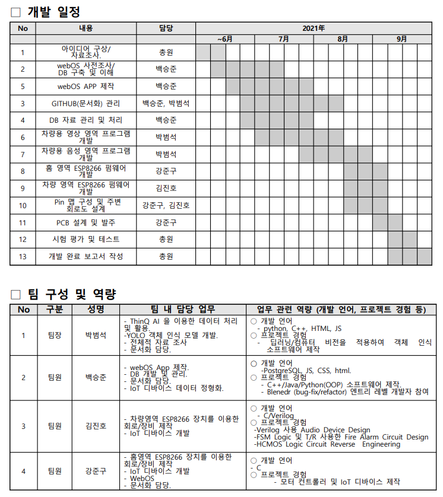

# 2021ESWContest_webOS_3007
Embedded Software Contest 2021_webOS_TEAM_ACOLYTE

  This project is conprised of two major sections: Hardware and Software.
  
  In the software section, we build an application program that suits well under webOS system architecture, regardless of its low level knowledge (e.g. kernal level, shell development).
  Our development will only pursuit on logic architecture of the webpage, which is a webOS app, and visualization of the database that stores data from hardware system.

## To Do list

## Milestone

## Logic flow of webOS application
