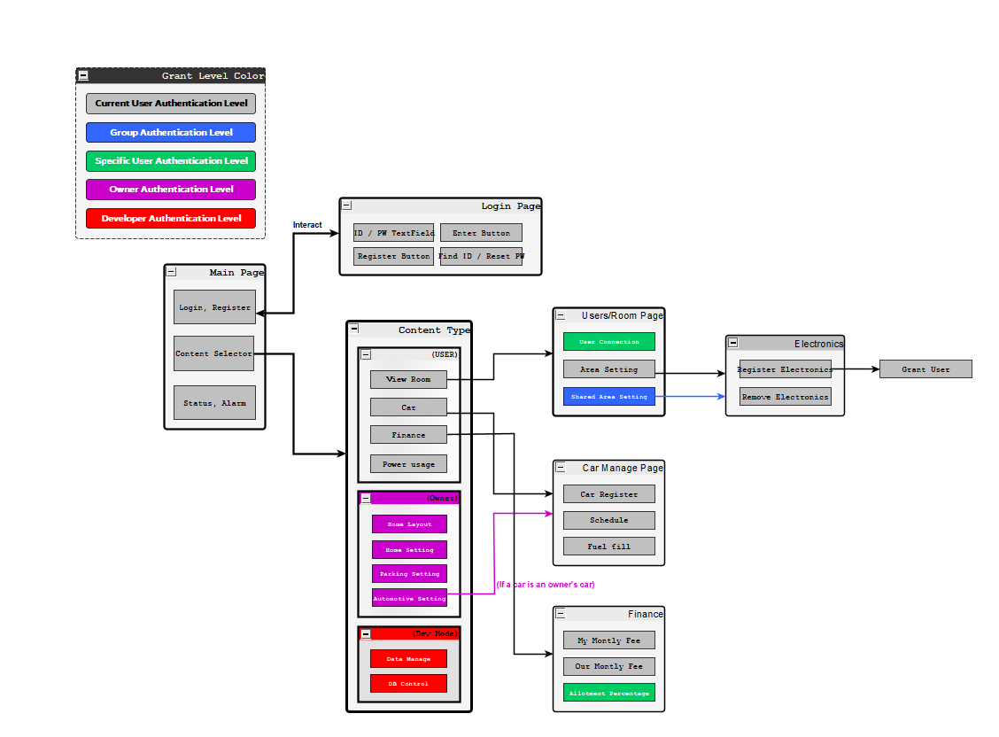

# 2021 Embedded Software Contest webOS 3007 ACOLYTE

## Who are we, and what are we aiming for?

**Who are we?**
> *'MarcoBackman'* will be handling a webOS application that requires html, css, js and database management system language skills.
>
>
>

**What is the ultimate goal of this project?**

**About our project**
  This project is conprised of two major sections: Hardware and Software.
  
  In the software section, we build an application program that suits well under webOS system architecture, regardless of its low level knowledge (e.g. kernal level, shell development).
  Our development will only pursuit on logic architecture of the webpage, which is a webOS app, and visualization of the database that stores data from hardware system.

### Encodings.
> We strickly regulate our code encoding to be in UTF-8 format. Use of any encoding format other then UTF-8 will be prohibited.

## To Do list
  *'MarcoBackman'* is currently working on webOS applications. Estimated overall job end-date is July 20th, but html,css part will be presumably finished before July 3rd.

## Milestone

## Logic flow of webOS application

