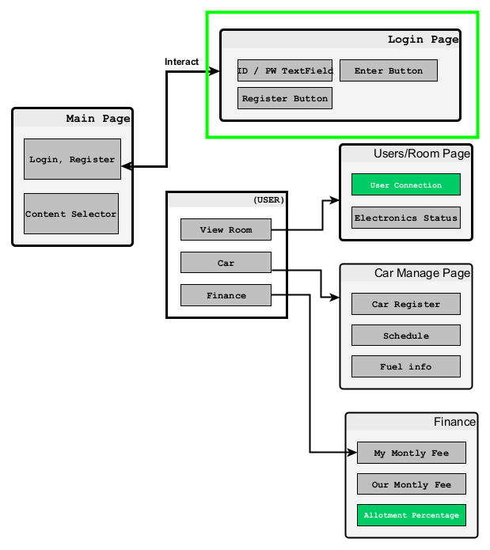

# 
2021 Embedded Software Contest webOS   3007-ACOLYTE

  

## Who are we, and what are we aiming for?

**Who are we?**
> &nbsp;&nbsp;**'@bammPark - AIdev •Team Leader'** is a team leader. He will be working on Yolo model plan design, applying LG ThinQ AI service(Audio filtering and Facial detection) to the project.   
> &nbsp;&nbsp;**'@MarcoBackman - SWdev • Collaborator'** is a SW developer. He will be handling a webOS application that requires html, css, js and database management system language skills.    
> &nbsp;&nbsp;**'@JuneKoo Kang - engineerjkk • Collaborator'** is a embedded developer. He will be handling ESP8266 hardware devices to recieve and send raw data over the network, and will handle PCB design and overall product ordering.     
> &nbsp;&nbsp;**'@submarine214 - supporter • Collaborator'** is a documenter/editor/tester. He will support us on overall workloads; especially focusing on documentation and testing.   

**What is the ultimate goal of this project?**
> &nbsp;&nbsp; The purpose of our development is to create a diverse and integrated system which involves overarching trends in Internet of Things(IoT). This project distinguishes from other features in associative automotive function with flexible finance distribution system in shared living environment.

## About our project 

&nbsp;&nbsp;The operating system is based on webOS system from LG, and we build the app that runs on it. Eventually, the the operating system that contains our developed app will run on Raspberry pi 4 machine with additional external devices connected to it(Touch monitor, sensers, voice receivers, wireless connection device, etc).
 
&nbsp;&nbsp; In general, this project is conprised of two major sections: Hardware and Software.
 
&nbsp;&nbsp; In the software section, we build an application program that suits well under webOS system architecture, regardless of its low level knowledge (e.g. kernal level, shell development).
 
&nbsp;&nbsp; Our development will only pursuit on logic architecture of the webpage, which is a webOS app, and visualization of the database that stores data from hardware system.
 

### Project regulations and Encodings.
> We have our own project regulation for developers. Please check the link: [Code Styles](https://github.com/MarcoBackman/2021ESWContest_webOS_3007/blob/main/document/webOS/Code_Style.md)
  
> We strickly regulate our code encoding to be in UTF-8 format. Use of any encoding format other then UTF-8 will be prohibited.

## To Do list
&nbsp;&nbsp; **'@bammPark'** and **'@JuneKoo Kang'** are currently preparing on thinQ AI processing and designing embedded system. - See: [HW 부문 계획](https://github.com/MarcoBackman/2021ESWContest_webOS_3007/projects/2)
  
&nbsp;&nbsp; **'@MarcoBackman'** is currently working on webOS applications. Estimated overall job end-date is August 30th. Still working on DB connection via web app. 
&nbsp;&nbsp; For detailed progress, see: [webOS webpage progress](https://github.com/MarcoBackman/2021ESWContest_webOS_3007/projects/1). 
&nbsp;&nbsp; For dev logs on SW and DB, see: [codeprojectnow](https://codeprojectnow.blogspot.com/). 
 

## Milestone.

  
  
[Milestone Image]

## Overall technical diagram.

  
  
[Entire project diagram.]

## Logic flow of webOS application.

  
  
[Logic flow for home webOS app.]

  
Red   - Indicates unimplemented work &#x1F44E;

  
Orange- Indicates to do work in soon &#x1F44C;

  
Green - Indicates implemented work &#x1F44D;

## Database overall design.

  
  
[atabase architecture]

  
Red   - Indicates unimplemented work &#x1F44E;

  
Green - Indicates implemented work &#x1F44D;

## Notices

> Some of the settings in the database and codes are bug-prone and has a lot of security issues such as injection attack.  
> However, this project mainly focuses on the IoT presentation instead of considering security and code details due to lack of development time.
